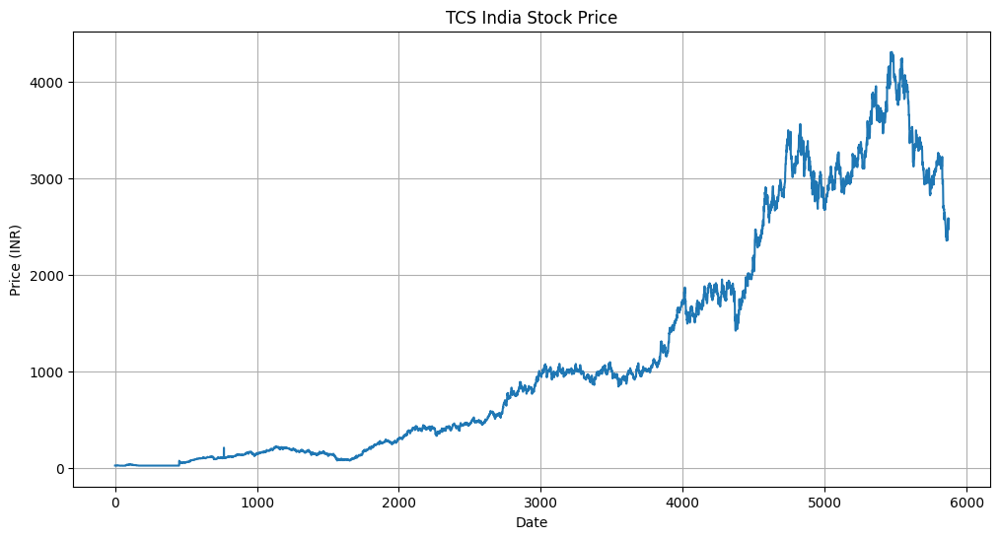
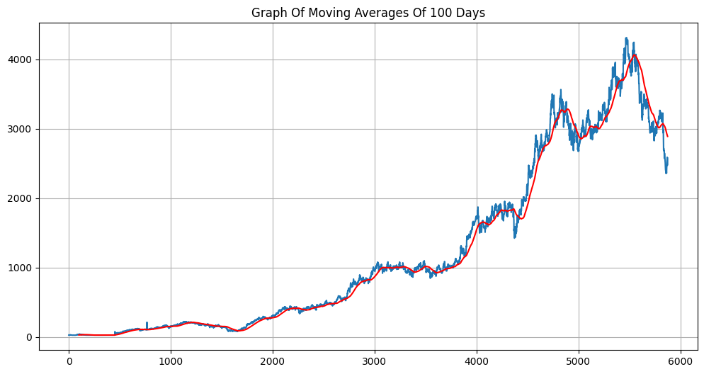
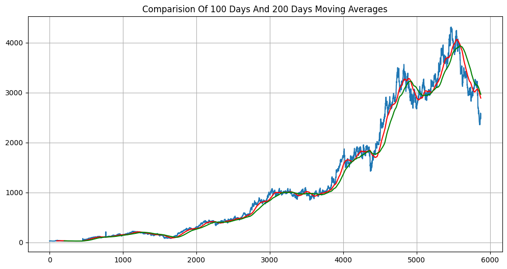
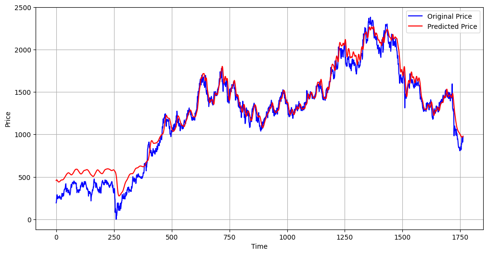

# Stock Price Prediction Using LSTM

A deep learning project that predicts stock prices using Long Short-Term Memory (LSTM) neural networks.

## Features

- Stock price prediction using LSTM model
- Moving Average analysis (MA100 & MA200)
- Interactive web application built with Streamlit
- Visualization of actual vs predicted prices

## Project Structure

- `Stock-Price-Prediction-Using-LSTM/` — Main project directory
  - `app.py` — Streamlit web application
  - `backend/` — Backend prediction logic
  - `keras_model.h5` — Trained LSTM model
  - `LSTM_model.ipynb` — Model training notebook
  - `LSTM_Improved_model(diff_dataset).ipynb` — Improved model notebook

## Visualizations

| Closing Price | MA100 vs Closing Price |
|---|---|
|  |  |

| MA100 & MA200 vs Closing Price | Actual vs Predicted |
|---|---|
|  |  |

## Tech Stack

- Python
- TensorFlow / Keras
- Streamlit
- NumPy, Pandas, Matplotlib

## Getting Started

```bash
cd Stock-Price-Prediction-Using-LSTM
pip install -r requirements.txt
streamlit run app.py
```
